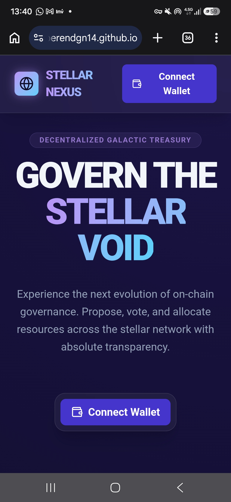
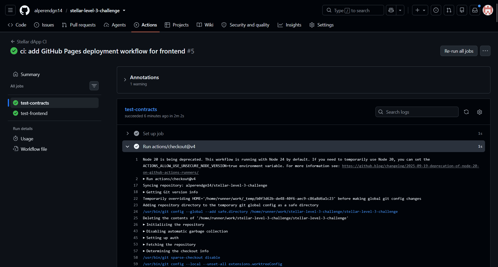
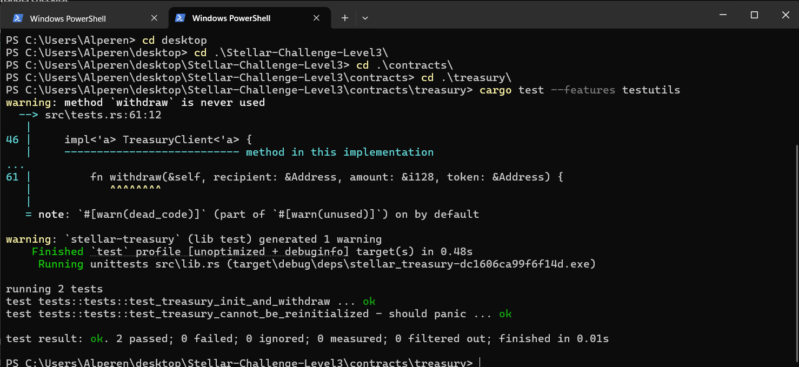
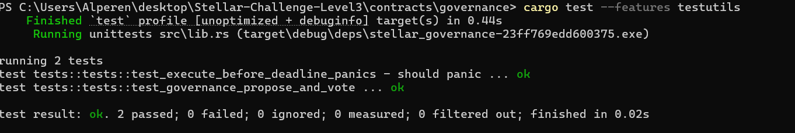

# Stellar Governance & Treasury dApp (Level 3)

A production-ready decentralized governance system built on Stellar Soroban — "Stellar Nexus".

Live demo: https://alperendgn14.github.io/stellar-level-3-challenge/

## 🚀 Features

- **Treasury Contract**: Manages communal funds and allows authorized, governance-gated withdrawals.
- **Governance Contract**: Enables proposal creation, voting, and execution of treasury disbursements, with contract-assigned proposal IDs.
- **Inter-Contract Communication**: Governance contract automatically triggers Treasury withdrawals upon successful vote execution.
- **Mobile-Responsive UI**: Built with React, TypeScript, and Tailwind CSS v4 ("Stellar Nexus" galactic theme).
- **Real On-Chain Integration**: Frontend talks directly to deployed testnet contracts via `@stellar/stellar-sdk`'s Soroban RPC contract client and the Freighter wallet.
- **CI/CD Pipeline**: Automated contract + frontend testing via GitHub Actions, plus an automated GitHub Pages deployment on every push to `main`.

## 🛠 Architecture

### Smart Contracts (Rust/Soroban)
- `contracts/treasury`: Holds funds and only allows withdrawals authorized by the linked governance contract. Guarded against re-initialization to prevent governance hijacking.
- `contracts/governance`: Manages the lifecycle of a proposal (Propose → Vote → Execute), with contract-assigned auto-incrementing proposal IDs and on-chain read functions (`get_proposal`, `get_proposal_count`).

### Frontend (React/TS)
- **State Management**: React hooks for wallet and contract interaction.
- **Wallet**: Freighter browser extension (`@stellar/freighter-api`).
- **Contract Calls**: `@stellar/stellar-sdk/contract` `Client` — dynamically generated method bindings from the on-chain contract spec, simulated read-only for views and signed + submitted for state changes.
- **UI/UX**: Responsive design with loading states and error handling.

## 📦 Installation & Setup

### Contracts
```bash
cd contracts/treasury
cargo test --features testutils

cd ../governance
cargo test --features testutils
```

### Frontend
```bash
cd frontend
npm install
npm run dev
```
Then open http://localhost:5173

## 🚢 Deployment

Contracts deployed to **Stellar Testnet**:

| Contract | Address | Deploy Tx |
|---|---|---|
| Treasury | `CCK36H2MUGBB56E6H7B6PWQEBIDJCNFWJ3B2MPQWXW2IWTY5LV6IFKFM` | [`8fc00f5b...940f`](https://stellar.expert/explorer/testnet/tx/8fc00f5b6e9f6e0cb928866c4a734682a9dc008eeaf7f06fc14f1f550313940f) |
| Governance | `CBRK5BKCTL3FOFNDGZ3QTUQREWJVEHOJG7JQLOTCJE6SLBFBQI7K4CCG` | [`09f7bb97...af69`](https://stellar.expert/explorer/testnet/tx/09f7bb9719c10f7d8134b46531e89a9f64a4341032b21e6e0046265ccf6af690) |

Linking transaction (`Treasury.init(governance_address)`): [`c0daea0c...634a`](https://stellar.expert/explorer/testnet/tx/c0daea0c4adbd560195c64cf28208a651c8c80cbdcf77efe8e7adc64aa90634a)

Sample governance activity created for the demo:
- `propose(...)` → proposal #1: [`46a14446...ab8b`](https://stellar.expert/explorer/testnet/tx/46a14446005ccd1479e3788ef8a39774f180cf3648a2642710016ff3c82cab8b)
- `vote(1, true, ...)`: [`24b737a3...9962f5`](https://stellar.expert/explorer/testnet/tx/24b737a3139c04c2a709edf15b651aa5b1d776bb7c3ceb2ea3168cdcc89962f5)

To redeploy yourself:
```bash
cd contracts/treasury
stellar contract build
stellar contract deploy --wasm target/wasm32v1-none/release/stellar_treasury.wasm --source <your-key> --network testnet

cd ../governance
stellar contract build
stellar contract deploy --wasm target/wasm32v1-none/release/stellar_governance.wasm --source <your-key> --network testnet

# Link them together
stellar contract invoke --id <treasury-id> --source <your-key> --network testnet -- init --governance <governance-id>
```

Then update `CONTRACT_ADDRESSES` in `frontend/src/utils/contract.ts` with your own deployed addresses.

## 🖼 Screenshots

**Mobile-responsive UI** (live GitHub Pages site on a phone):



**CI/CD pipeline passing** (contracts + frontend jobs, GitHub Actions):



**3+ passing tests** (Treasury: 2 tests, Governance: 2 tests):




## 🎬 Demo Video

https://www.youtube.com/watch?v=bFN5FUq6UhY

## 📋 Submission Checklist
- [x] Public GitHub repository
- [x] README with complete documentation
- [x] 10+ meaningful commits
- [x] Live demo link (GitHub Pages)
- [x] Contract deployment address (Stellar Testnet, see table above)
- [x] Transaction hash for contract interaction (see table above)
- [x] Screenshots (mobile UI, CI/CD run, 3+ passing tests)
- [x] Demo video link
